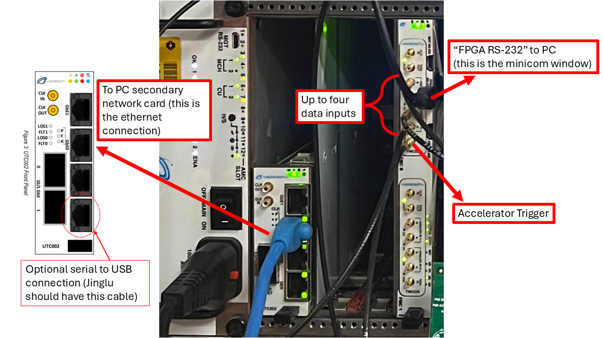

Referencing the above image, there are four important steps to setting up the uTCA crate.

1) Connect ethernet cable from the UTC002 "GbE0" port to the secondary (lower) ethernet port on the computer (don't plug it into the motherboard slot).
2) On the AMC502 card on the right, connect the RS-232 mini-USB cable to the "FPGA RS-232" port, and connect that to the computer.
3) Connect the trigger and data inputs as required into the first FMC228 module in the left AMC502 card. 

Even if there are no data inputs, just connecting the trigger and turning on the crate can allow for diagnostic tests using the ADC test modes. 

Similarly, even without a trigger input, the ADC can be setup to run on a self-trigger mode. 

An optional final cable can be connected from the "SER" output of the UTC002 control module to a USB port on the PC, which should allow for remote power management of the uTCA cards should the ethernet connection to the crate be lost.